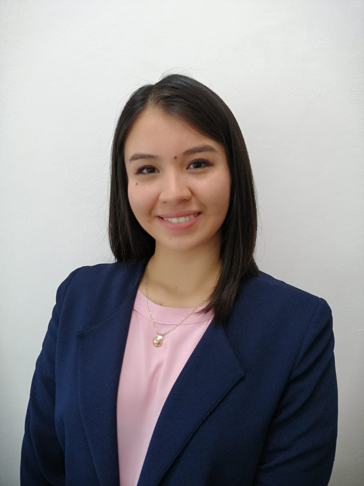

# R-ladies Xalapa 💜

## Detalle Estadistico de San Valentin

📲¿Cuánto has texteado con tus amix en la última semana? 
- ¿En qué momento acostumbras a escribirle a tu familia? 👩🏻👵🏼🧑🏼‍🦰👧🏽 

En este taller aprenderás a realizar un análisis de tus mensajes de Whatsapp en R, que podrás regalar con motivo de San Valentín 💜

## Ponente: Ameyalli de Jesus Perea Carreto

Ame, como le gusta que le llamen, es Actuaria por coincidencia y Científica de Datos por elección. Originaria de Xalapa, Veracruz, se muda a los 18 años a Mérida, donde estudió en la Facultad de Matemáticas de la Universidad Autónoma de Yucatán la Licenciatura en Actuaría. Como parte de las prácticas profesionales trabaja en la valuación de patentes del INECOL (Instituto de Ecología, A.C.) y es cuando se da cuenta de cuán importante es entender que hay datos que no se explican por sí mismos, por lo que decide aplicar para la Maestría en Cómputo Estadístico de CIMAT (Centro de Investigación en Matemáticas A.C.), en la unidad Monterrey. Actualmente trabaja en su Tesis sobre Identificación Automática de temas en Twitter asociados a la violencia de género durante la pandemia en México. Hoy es Científica de Datos en el Dirección de Analítica e Inteligencia Institucional del Tecnológico de Monterrey donde elabora modelos de aprendizaje máquina que apoyan a la toma de decisiones del Tec.

Participa de actividades tales como Concursos de Oratoria y Debate, siendo ponente del 1er Día Nacional de la Oratoria en Yucatán en 2016. Además de haber sido representante de la UADY en un Modelo de las Naciones Unidas, organizado por la embajada de Italia en la ONU ciudad de Nueva York en 2019.  Actividades muy diferentes a las que a un actuario se le pueden adjudicar como haber trabajado en compañías de teatro, escribir cuentos (2do. Lugar Nacional en el Concurso de Cuento Histórico 2014) y cantar son aquellas que desarrolla en su tiempo libre (que no es mucho dada la carga de trabajo y el posgrado).

